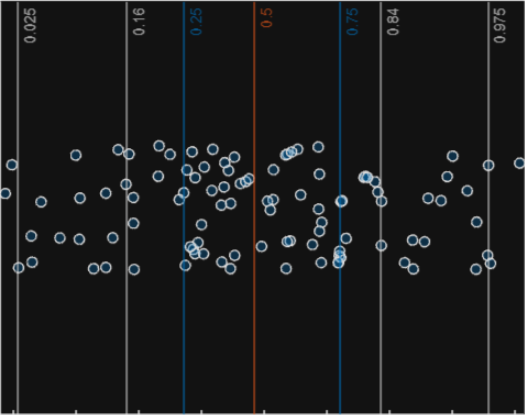
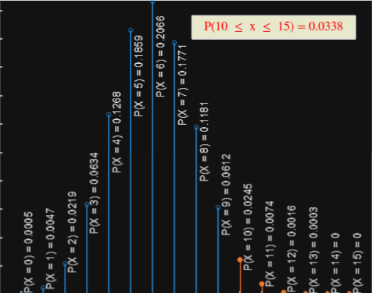
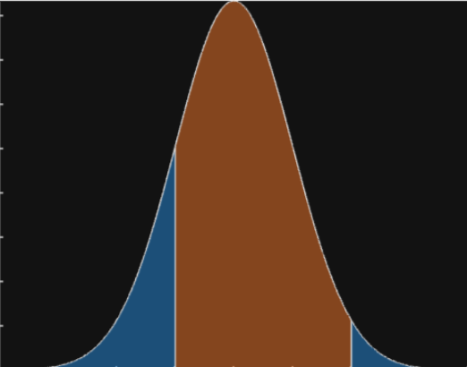
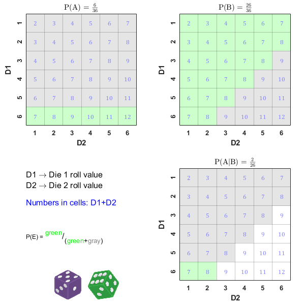

# Descriptive Statistics and Probability Distributions

 or 

**Curriculum Module**

_Created with R2024a. Compatible with R2024a and later releases._

# Information

This curriculum module contains interactive [MATLAB® live scripts](https://www.mathworks.com/products/matlab/live-editor.html) that teach the fundamentals of descriptive statistics and some commonly used probability distributions.

## Background

You can use these live scripts as demonstrations in lectures, class activities, or interactive assignments outside class. This module covers descriptive statistics such as mean, median, range, variance and standard deviation and visualizations such as histograms and boxplots. Additional scripts address discrete and continuous probability distributions including the binomial and Poisson distributions as well as the uniform, normal, and exponential distributions. 

The instructions inside the live scripts will guide you through the exercises and activities. Get started with each live script by running it one section at a time. To stop running the script or a section midway (for example, when an animation is in progress), use the  Stop button in the **RUN** section of the **Live Editor** tab in the MATLAB Toolstrip.

## Contact Us

Solutions are available upon instructor request. Contact the [MathWorks teaching resources team](mailto:onlineteaching@mathworks.com) if you would like to request solutions, provide feedback, or if you have a question.

## Prerequisites

This module assumes knowledge of MATLAB at the level of the [MATLAB Onramp](https://matlabacademy.mathworks.com/details/matlab-onramp/gettingstarted), a free two\-hour introductory course.

## Getting Started
### Accessing the Module
### **On MATLAB Online:**

Use the  link to download the module. You will be prompted to log in or create a MathWorks account. The project will be loaded, and you will see an app with several navigation options to get you started.

### **On Desktop:**

Download or clone this repository. Open MATLAB, navigate to the folder containing these scripts and double\-click on [StatsAndProb.prj](https://matlab.mathworks.com/open/github/v1?repo=MathWorks-Teaching-Resources/Descriptive-Stats-and-Probability&project=StatsAndProb.prj&file=README.mlx). It will add the appropriate files to your MATLAB path and open an app that asks you where you would like to start. 

Ensure you have all the required products (listed below) installed. If you need to include a product, add it using the Add\-On Explorer. To install an add\-on, go to the **Home** tab and select   **Add-Ons** > **Get Add-Ons**. 

## Products

MATLAB® and the Statistics and Machine Learning Toolbox™ are used throughout

# Scripts
## [**DescriptiveStatistics.mlx**](https://matlab.mathworks.com/open/github/v1?repo=MathWorks-Teaching-Resources/Descriptive-Stats-and-Probability&project=StatsAndProb.prj&file=Scripts/DescriptiveStatistics.mlx) 
|      |      |
| :-- | :-- |
|  | **In this script, students will...**     |
|     | $\bullet$ display a quantitative variable as a histogram.   $\bullet$ determine and interpret the mean, median, range, variance, standard deviation, and measures of position.   $\bullet$ display a quantitative variable as a boxplot.     |
|      |       |

## [**DiscreteDistributions.mlx**](https://matlab.mathworks.com/open/github/v1?repo=MathWorks-Teaching-Resources/Descriptive-Stats-and-Probability&project=StatsAndProb.prj&file=Scripts/DiscreteDistributions.mlx) 
|      |      |
| :-- | :-- |
|  | **In this script, students will...**     |
|     | $\bullet$ define a probability distribution.   $\bullet$ find statistics given a discrete probability distribution.   $\bullet$ use the binomial distribution, hypergeometric distribution, and Poisson distribution.     |
|      |       |

## [**ContinuousDistributions.mlx**](https://matlab.mathworks.com/open/github/v1?repo=MathWorks-Teaching-Resources/Descriptive-Stats-and-Probability&project=StatsAndProb.prj&file=Scripts/ContinuousDistributions.mlx) 
|      |      |
| :-- | :-- |
|  | **In this script, students will...**     |
|     | $\bullet$ describe and use the uniform probability distribution.   $\bullet$ describe and use the normal and standard normal probability distributions.   $\bullet$ describe and use the exponential probability distribution.     |
|      |       |

# Related Courseware Modules
|      |      |      |
| :-- | :-- | :-- |
| **Courseware Module**    | **Sample Content**    | **Available on:**     |
| [**Fundamentals of Probability Theory**](https://www.mathworks.com/matlabcentral/fileexchange/100546-probability-theory)    |     |       [GitHub](https://github.com/MathWorks-Teaching-Resources/Probability-Theory)     |
|      |      |       |

Or feel free to explore our other [modular courseware content](https://www.mathworks.com/matlabcentral/fileexchange/?q=tag%3A%22courseware+module%22&sort=downloads_desc_30d).

# Educator Resources
-  [Educator Page](https://www.mathworks.com/academia/educators.html) 

# Contribute 

Looking for more? Find an issue? Have a suggestion? Please contact the [MathWorks teaching resources team](mailto:%20onlineteaching@mathworks.com). If you want to contribute directly to this project, you can find information about how to do so in the [CONTRIBUTING.md](https://github.com/MathWorks-Teaching-Resources/Descriptive-Stats-and-Probability/blob/release/CONTRIBUTING.md) page on GitHub.

 *©* Copyright 2023 The MathWorks™, Inc

